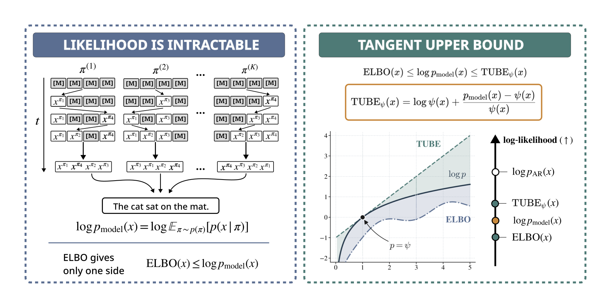

<h1 align="center">TUBE: Tangent Upper Bound on Evidence<br>for Discrete Diffusion Language Models</h1>

<div align="center">

**[Arseny Ivanov](https://scholar.google.com/citations?user=lvr79TEAAAAJ&hl=ru)**<sup>1,2,3</sup>,
**[Sergei Kholkin](https://scholar.google.com/citations?user=KwhztSMAAAAJ&hl=en)**<sup>2</sup>,
**[Vladislav Gromadskii](https://www.researchgate.net/profile/Vladislav-Gromadskii)**<sup>2</sup>,
**[Grigoriy Ksenofontov](https://scholar.google.com/citations?user=e0mirzYAAAAJ&hl=ru)**<sup>2,4</sup>,
**[Ivan Oseledets](https://scholar.google.com/citations?user=5kMqBQEAAAAJ&hl=en)**<sup>1,2</sup>,
**[Alexander Korotin](https://scholar.google.com/citations?user=1rIIvjAAAAAJ&hl=ru)**<sup>2,1</sup>

<sup>1</sup>AXXX &nbsp; <sup>2</sup>Applied AI Institute &nbsp; <sup>3</sup>HSE University &nbsp; <sup>4</sup>MIRAI

[](https://arxiv.org/abs/2605.24292)
[](https://arseny5.github.io/tube/)

</div>

## Official Code Repository

<p align="center">
  
</p>

**Overview of TUBE.** *Left:* the log-likelihood of masked / any-order diffusion models is intractable, as it marginalizes over all latent generation orders. *Right:* TUBE is a tractable upper bound that, together with the ELBO, two-sidedly localizes the true log-likelihood, ELBO(x) ≤ log p(x) ≤ TUBE(x).

## Abstract

Log-likelihood is a standard metric for evaluating generative models. Unfortunately, in contrast to autoregressive models (ARMs), discrete diffusion models generally do not admit exact computation of this quantity. Existing evaluations, therefore, rely on the evidence lower bound (ELBO), leaving unclear how much higher the true value may be. We address this by introducing the **Tangent Upper Bound on Evidence (TUBE)**, a variational upper bound on log-likelihood that admits an unbiased Monte Carlo estimator. Our TUBE extends across latent-variable models, including masked diffusion models (MDMs), any-order ARMs (AO-ARMs), and block variants of both. Applied to block MDMs and block AO-ARMs, TUBE reveals our key empirical finding that these models lie strictly below the exact ARM baseline, showing that ARMs still dominate in likelihood.

## Code

⏳ Code will be released soon.

## Citing

If you find this work useful, please cite:

```bibtex
@article{ivanov2026tube,
  title   = {TUBE: Tangent Upper Bound on Evidence for Discrete Diffusion Language Models},
  author  = {Ivanov, Arseny and Kholkin, Sergei and Gromadskii, Vladislav and
             Ksenofontov, Grigoriy and Oseledets, Ivan and Korotin, Alexander},
  journal = {arXiv preprint arXiv:2605.24292},
  year    = {2026}
}
```
